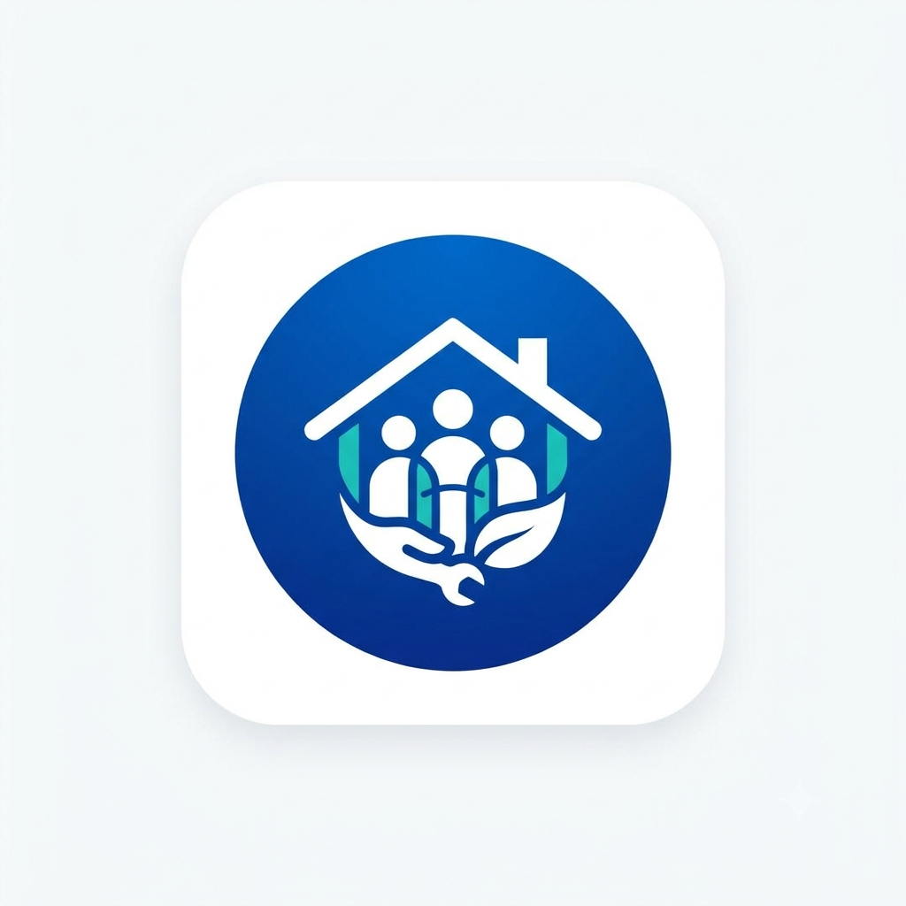
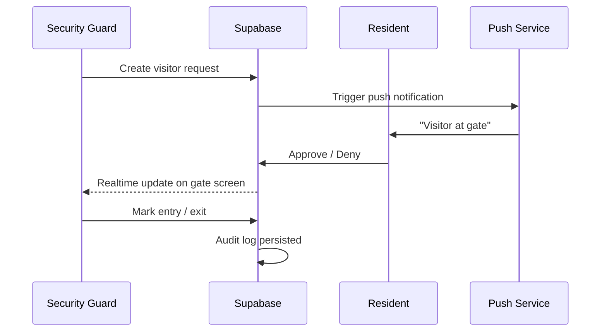

<div align="center">



# Portl

**The society gate, in your pocket.**

A mobile-first platform that unifies visitor management, community operations, and society administration — built for **Residents**, **Security Guards**, and **Society Admins** on a single, secure stack.

[](https://expo.dev)
[](https://reactnative.dev)
[](https://www.typescriptlang.org)
[](https://supabase.com)
[](https://clerk.com)

**Repository:** [github.com/saurabhravte/portl](https://github.com/saurabhravte/portl)

</div>

---

## Table of Contents

- [Overview](#overview)
- [The Problem](#the-problem)
- [Our Solution](#our-solution)
- [Key Features](#key-features)
- [How It Works](#how-it-works)
- [Live Demo](#live-demo)
- [Architecture](#architecture)
- [Tech Stack](#tech-stack)
- [Getting Started](#getting-started)
- [Build & Deploy](#build--deploy)
- [Testing](#testing)
- [Project Structure](#project-structure)
- [License](#license)

---

## Overview

**Portl** replaces the fragmented gate experience — intercom calls, WhatsApp groups, paper registers, and missed approvals — with one real-time mobile app. When a visitor arrives, the guard raises a request, the resident approves in seconds, and every entry is logged with full auditability.

Designed for Indian apartment societies at scale, Portl ships role-specific experiences for every stakeholder while enforcing permissions **server-side** through PostgreSQL Row Level Security (RLS). The UI never decides who can access what — the database does.

---

## The Problem

| Pain point                     | Impact                                                                                         |
| ------------------------------ | ---------------------------------------------------------------------------------------------- |
| Gate intercoms and phone calls | Residents miss calls; visitors wait; guards repeat the same workflow dozens of times per shift |
| WhatsApp groups for approvals  | No audit trail, no role separation, no escalation when someone is unavailable                  |
| Paper visitor registers        | Impossible to search, report on, or reconcile after the fact                                   |
| Disconnected society ops       | Notices, dues, complaints, and amenity bookings live in separate channels                      |

Communities lose time, security visibility, and trust — not because staff are inefficient, but because the tools were never built for how gates actually work.

---

## Our Solution

Portl is an end-to-end society operations platform with a **live gate workflow** at its core:

1. **Guard** registers a walk-in or scans a pre-approval code
2. **Resident** receives a push notification and taps **Approve** or **Deny**
3. **Gate screen** updates in real time via Supabase Realtime
4. **Entry and exit** are timestamped, searchable, and auditable

Beyond the gate, the same app handles helpdesk tickets, community notices, polls, amenity bookings, maintenance dues (Razorpay), parcel tracking, SOS alerts, and admin reporting — without switching apps or channels.

---

## Key Features

### For Residents

- Approve or deny visitor requests in real time
- Pre-approve guests with QR codes or 6-digit gate codes
- Raise and track helpdesk tickets
- Read notices, vote in polls, and engage with community features
- Book amenities, pay maintenance dues, and manage household details
- View visitor history, parcels, vehicles, and security alerts

### For Security Guards

- Register walk-in visitors (guest, delivery, cab, service)
- Search flats and residents; verify pre-approval codes
- Live gate queue with mark entry / mark exit
- Shift management, parcel handoff, and full gate history

### For Society Admins

- Manage towers, flats, members, guards, staff, and service providers
- Publish notices, run polls, configure amenities, and assign dues
- Resolve complaints, review gate operations, and access audit logs
- Insights dashboard for society-wide visibility

### Platform Highlights

| Capability              | Detail                                                   |
| ----------------------- | -------------------------------------------------------- |
| **Security-first**      | Clerk authentication + Supabase RLS on every table       |
| **Real-time gate flow** | Live updates across guard and resident devices           |
| **Auto-escalation**     | Unanswered visitor requests escalate automatically       |
| **Offline resilience**  | Queued actions sync when connectivity returns            |
| **Payments**            | Razorpay integration for maintenance dues                |
| **Push notifications**  | Expo Push via Supabase Edge Functions                    |
| **Production-ready**    | EAS Build, OTA updates, Sentry monitoring, SQL RLS tests |

---

## How It Works



**Hero flow:** Guard taps _New Visitor_ → Resident gets notified → taps _Approve_ → Guard's screen updates live → _Mark Entry_ / _Mark Exit_. If the resident does not respond in time, the request auto-escalates.

---

## Live Demo

### Try the App

| Resource        | Link                                                |
| --------------- | --------------------------------------------------- |
| **Android APK** | `<YOUR_EAS_BUILD_LINK>`                             |
| **Demo video**  | `<YOUR_DEMO_VIDEO_URL>`                             |
| **Screenshots** | Add images to `/screenshots` and update paths below |

> After running an EAS `preview` build, paste the download link above. Open on Android → download `.apk` → allow _Install unknown apps_ → install.

### Screenshots

> Add screenshots to a `/screenshots` folder and update the paths below.

|            Resident — Approval             |             Guard — Gate             |             Admin — Dashboard             |
| :----------------------------------------: | :----------------------------------: | :---------------------------------------: |
|  |  |  |

|                Pre-approval QR                |               Helpdesk                |             Notices & Polls             |
| :-------------------------------------------: | :-----------------------------------: | :-------------------------------------: |
|  |  |  |

---

## Architecture

```
┌─────────────────────────────────────────────────────────────┐
│                     Expo / React Native App                   │
│  expo-router (role groups) · TanStack Query · Zustand · Zod   │
└──────────────────────────┬──────────────────────────────────┘
                           │ Clerk JWT
                           ▼
┌─────────────────────────────────────────────────────────────┐
│                        Supabase                             │
│  Postgres + RLS · Realtime · Storage · Edge Functions       │
└──────────────────────────┬──────────────────────────────────┘
                           │
          ┌────────────────┼────────────────┐
          ▼                ▼                ▼
    Expo Push         Razorpay          Sentry
    (FCM/APNs)        (payments)        (monitoring)
```

**Role routing:** File-based routes under `(resident)`, `(guard)`, and `(admin)` groups. Session routing sends each authenticated user to the correct dashboard based on their society role.

**Data layer:** TanStack Query for server state, Zustand for client state, Zod for validation. All mutations respect RLS policies — unauthorized requests fail at the database, not in client-side checks.

---

## Tech Stack

| Layer             | Technology                                                  |
| ----------------- | ----------------------------------------------------------- |
| **Mobile**        | Expo SDK 55, React Native 0.83, React 19, TypeScript        |
| **Routing**       | expo-router with typed routes and role-based groups         |
| **Auth**          | Clerk (`@clerk/expo`) — email, phone, Google Sign-In        |
| **Backend**       | Supabase — Postgres, RLS, Realtime, Storage, Edge Functions |
| **Data**          | TanStack Query, Zustand, Zod                                |
| **Styling**       | Uniwind (Tailwind CSS v4) with light/dark theme support     |
| **Payments**      | Razorpay                                                    |
| **Notifications** | Expo Push → FCM, via Supabase Edge Functions                |
| **Observability** | Sentry                                                      |
| **Delivery**      | EAS Build (APK / AAB) + EAS Update (OTA)                    |
| **Quality**       | ESLint, Jest, React Native Testing Library, SQL RLS tests   |

---

## Getting Started

### Prerequisites

- **Node.js** ≥ 20 and **Git**
- **Bun** (recommended; `bun.lock` included) — or npm/yarn
- **EAS CLI** and **Supabase CLI**:
  ```bash
  npm install -g eas-cli supabase
  ```
- Free accounts on [expo.dev](https://expo.dev), [supabase.com](https://supabase.com), and [clerk.com](https://clerk.com)

### Install

```bash
git clone https://github.com/saurabhravte/portl.git
cd portl
bun install
```

### Environment Variables

Copy the example file and fill in your keys (`.env.local` takes precedence over `.env`):

```bash
cp .env.example .env.local
```

Minimum for local development:

```bash
EXPO_PUBLIC_SUPABASE_URL=https://YOUR-PROJECT.supabase.co
EXPO_PUBLIC_SUPABASE_ANON_KEY=eyJ...
EXPO_PUBLIC_CLERK_PUBLISHABLE_KEY=pk_test_...
```

> Variables prefixed with `EXPO_PUBLIC_` are bundled into the app and are **not** secrets. Service-role keys belong only in Supabase Edge Functions.

### Connect Clerk to Supabase

Every RLS policy reads the logged-in user from the Clerk JWT (`auth.jwt() ->> 'sub'`). **Skipping this step causes empty screens across the app.**

1. **Clerk Dashboard** → _Configure_ → _Integrations_ → enable **Supabase**
2. **Supabase Dashboard** → _Authentication_ → _Sign In / Providers_ → _Third-Party Auth_ → **Add provider → Clerk** — paste your Clerk frontend API domain
3. In **Clerk → User & authentication**, enable email (password + email code) and phone (SMS). Portl expects E.164 numbers (e.g. `+919876543210`)

The Clerk token is attached to Supabase automatically in `src/lib/supabase.ts`.

### Database Setup

```bash
supabase db reset      # applies migrations + seed.sql
supabase functions deploy
```

This creates all tables, RLS policies, the `society-media` storage bucket, and baseline demo data.

### Create Demo Users

The baseline seed is identity-free. Wire real Clerk logins to the demo society:

1. In **Clerk**, create three development users (resident, guard, admin) and copy each **subject id** (`user_...`).
2. Apply the demo fixture:
   ```bash
   psql "$DATABASE_URL" \
     -v resident_id="<resident Clerk subject>" \
     -v guard_id="<guard Clerk subject>" \
     -v admin_id="<admin Clerk subject>" \
     -f supabase/demo_seed.sql
   ```
   On Windows PowerShell: `$env:DATABASE_URL`.

This maps the three Clerk users to Resident **Ravi**, Guard **Ganesh**, and Admin **Anita** in _Sunrise Heights_.

### Run Locally

```bash
bun start
```

Scan the QR code with **Expo Go (SDK 55)** and sign in as each demo user to verify role-specific dashboards.

| Works in Expo Go                             | Requires dev / APK build   |
| -------------------------------------------- | -------------------------- |
| Email & phone login, all role dashboards     | Razorpay payments          |
| Visitor / gate flow, notices, polls, tickets | Google Sign-In             |
| Amenities, live Supabase data                | Push notifications, Sentry |

**Windows tip:** If Metro fails with `EMFILE`, stop Node processes, clear `%LOCALAPPDATA%\Temp\metro-cache`, and restart with `bun start`. Use `bun expo start --tunnel` if LAN connection fails.

---

## Build & Deploy

### Shareable APK

The **`preview`** profile produces a standalone `.apk` for judges and testers.

**Before building:**

1. Set the full release variable set in EAS (`preview` environment):  
   `APP_ENV`, `EXPO_OWNER`, `EAS_PROJECT_ID`, `EXPO_IOS_BUNDLE_IDENTIFIER`, `EXPO_ANDROID_PACKAGE`, `EXPO_PUBLIC_SUPABASE_URL`, `EXPO_PUBLIC_SUPABASE_ANON_KEY`, `EXPO_PUBLIC_CLERK_PUBLISHABLE_KEY`, `EXPO_PUBLIC_SENTRY_DSN`, `SENTRY_ORG`, `SENTRY_PROJECT`, `SENTRY_AUTH_TOKEN`
2. Commit your work — `eas.json` sets `requireCommit: true`

```bash
eas init                                    # first time only
eas env:create --environment preview ...    # add each variable
git add -A && git commit -m "Configure preview build"
bun run build:apk                           # eas build --platform android --profile preview
```

EAS prints a download link and QR code (~5–15 min). Paste the link in [Live Demo](#live-demo).

For Play Store: `bun run build:production` then `eas submit --platform android`.

### Over-the-Air Updates

Ship JavaScript and UI fixes without a new APK:

```bash
bun run update:preview      # preview channel
bun run update:prod         # production (+ Sentry sourcemaps)
```

Native changes (permissions, libraries, SDK upgrades) always require a fresh build.

---

## Testing

```bash
bun test                 # Jest unit + component tests
bun run typecheck        # TypeScript
bun run lint             # ESLint
bun run test:rls         # Supabase RLS policy tests
```

---

## Project Structure

```
portl/
├── assets/
│   ├── app-icons-light-dark/ # App icons (Light + Dark, iOS + Android)
│   └── images/
├── src/
│   ├── app/                  # expo-router routes
│   │   ├── (auth)/           # sign-in, sign-up, onboarding
│   │   ├── (resident)/       # home, approve, community, helpdesk, payments…
│   │   ├── (guard)/          # gate, new-visitor, queue, code, shifts…
│   │   └── (admin)/          # dashboard, manage/{towers,flats,members,dues…}
│   ├── components/           # shared UI (BrandMark, states, media…)
│   ├── features/             # domain logic (visitors, tickets, payments…)
│   ├── lib/                  # supabase client, auth, helpers
│   ├── stores/               # Zustand stores
│   └── theme/                # design tokens, light/dark palettes
├── supabase/
│   ├── migrations/           # ordered SQL (schema + RLS + features)
│   ├── functions/              # Edge Functions (push, razorpay, privacy…)
│   ├── seed.sql                # identity-free baseline demo data
│   └── demo_seed.sql           # binds demo users to Clerk subjects
├── app.json / app.config.js    # Expo config (env-driven)
├── eas.json                    # build profiles + environments
└── package.json
```

---

## License

This project was built for hackathon demonstration. See repository license terms for usage and distribution.

---

<div align="center">


**Portl** — Built with Expo, React Native, Clerk, and Supabase.

_The day a guard says the app is faster than calling the flat, Portl has won the gate._

</div>
